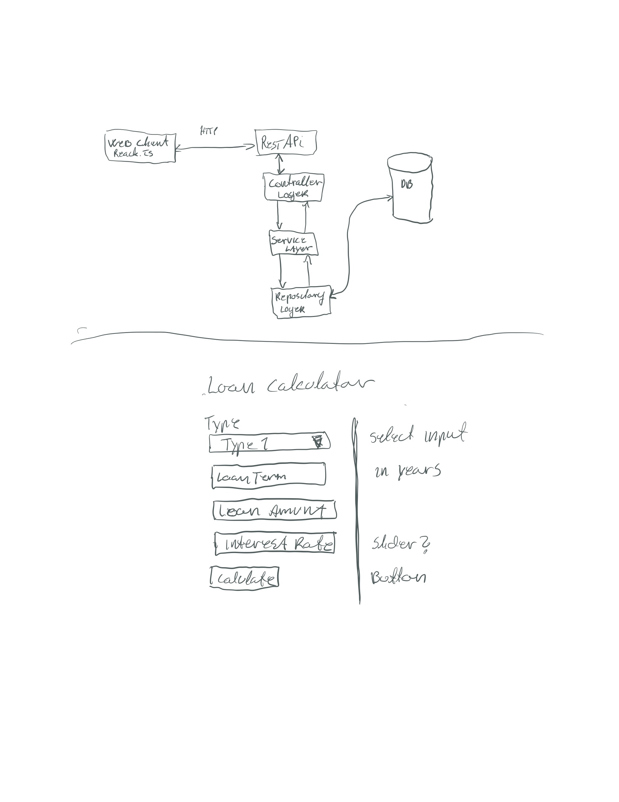
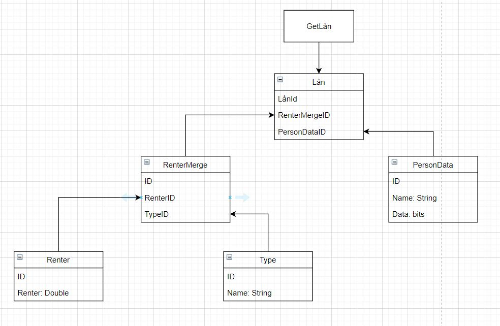

# ZDataProgrammingTask

**Data flow og enkel skisse for frontend**

**Database**
For denne demoen har jeg bare brukt en tabel som lagrer type og rente, for at alt skulle være enkelt.

Dersom dette skulle videre utviklse ville jeg kanksje foretslått en database struktur som vist under 

